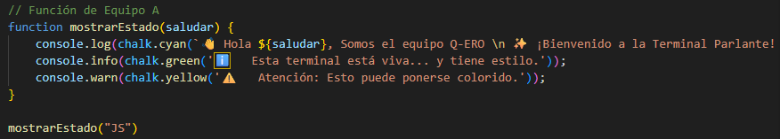
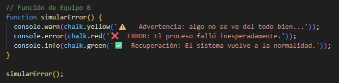
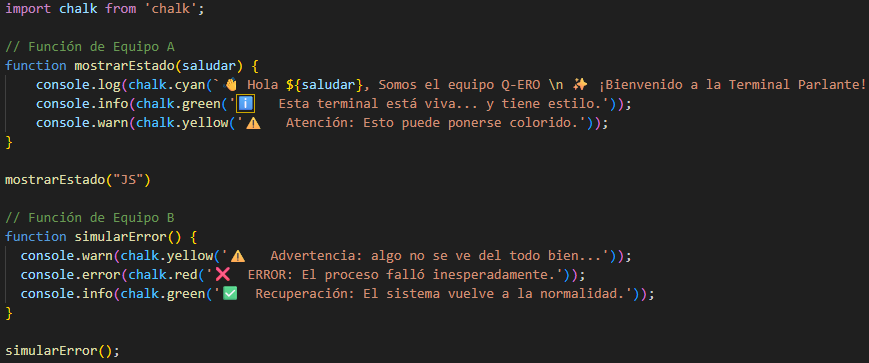
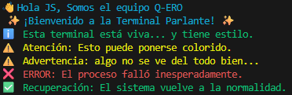

<h1 align="center">🎙️ La Terminal Parlante 🎙️ </h1>

Este proyecto fue desarrollado como parte del aprendizaje de **JavaScript** aplicado en entorno de **Node.js**, utilizando **npm** para la gestión de dependencias, comandos de **terminal** y colaboración mediante **GitHub**. 

El **objetivo** fue crear un programa que mostrara mensajes estilizados en la consola usando la librería **chalk**, mientras practicábamos el flujo de trabajo colaborativo con ramas, commits y pull requests.

<table>
<tr>
<td>

## 👥 Equipo Q-ERO v3 Protocol

- Washington Mardones
- Agustín Valenzuela
- Karim Valenzuela  
- Javier Valenzuela   
- Anita Morales  
- Nicolás Peña 

</td>
<td align="center" valign="middle" width="320">
  
</td>
</tr>
</table>

## 🧩 Objetivos del Desafío

- Instalar dependencias usando **npm**.
- Utilizar distintos tipos de mensajes en consola: `log`, `info`, `warn`, `error`.
- Aplicar **modularidad** con funciones.
- Trabajar en **ramas por equipo** y usar **Pull Requests**.
- Implementar `.gitignore` para evitar subir archivos innecesarios.

## 🗂️ Estructura del Proyecto
terminal-color/   
├── README.md   
├── index.js   
├── package.json    
├── package-lock.json ← Se mantiene (asegura versiones iguales para todos)    
└── .gitignore ← Evita subir node_modules     

> `node_modules/` no se sube al repositorio, pero se genera automáticamente con `npm install`

## 🧠 Reflexión

### 📦 ¿Qué aprendimos sobre dependencias y npm?

- `npm` permite instalar herramientas externas que podemos usar en nuestro programa.
- `package.json` registra qué dependencias utiliza el proyecto.
- Aprendimos que **`node_modules/` no debe subirse al repositorio** porque se puede regenerar con `npm install`.
- **`package-lock.json` sí se mantiene**, ya que asegura que todos tengamos las mismas versiones de dependencias en nuestros equipos.

### 🌿 ¿Por qué es importante trabajar con ramas?

- Evita conflictos cuando varias personas trabajan al mismo tiempo.
- Permite desarrollar funciones o partes del proyecto sin romper el código principal.
- Facilita la revisión y el control antes de mezclar los cambios en la rama `main`.

### 📝 Diferencias entre los tipos de `console`

| Comando          | Uso recomendado                        |
|------------------|----------------------------------------|
| `console.log()`  | Mensajes generales.                    |
| `console.info()` | Información útil o de estado.          |
| `console.warn()` | Advertencias preventivas.              |
| `console.error()`| Errores o problemas importantes.       |

## 🧱 Aportes por Equipo

### 🔹 Equipo A — Función `mostrarEstado()`

### 🔹 Equipo B — Función `simularError()`

### 🔹 Equipo A + Equipo B

## 🖼️ Resultado Final del Proyecto

## 💀 Errores que Ocurrieron

Al crear el repositorio inicialmente **no incluimos** el archivo `.gitignore`, por lo que la carpeta `node_modules/` se subió completa a GitHub.  
Esto hizo que el repositorio quedara más pesado de lo necesario.

Para solucionarlo:

1. Creamos el archivo `.gitignore` en la raíz del proyecto.
2. Dentro añadimos la siguiente línea: node_modules/
3. Luego eliminamos la carpeta node_modules

### Con esto aprendimos la importancia de:

- Evitar subir archivos pesados e innecesarios al repositorio.
- Usar .gitignore desde el inicio del proyecto para mantener el repositorio limpio y profesional.

## 🎓 Conclusión

Este proyecto nos permitió:
- Trabajar en equipo de manera organizada.
- Usar herramientas reales de desarrollo profesional.
- Entender cómo se estructura y ejecuta un proyecto en Node.js.
- Practicar decisiones técnicas importantes (como `.gitignore` y manejo de dependencias).
